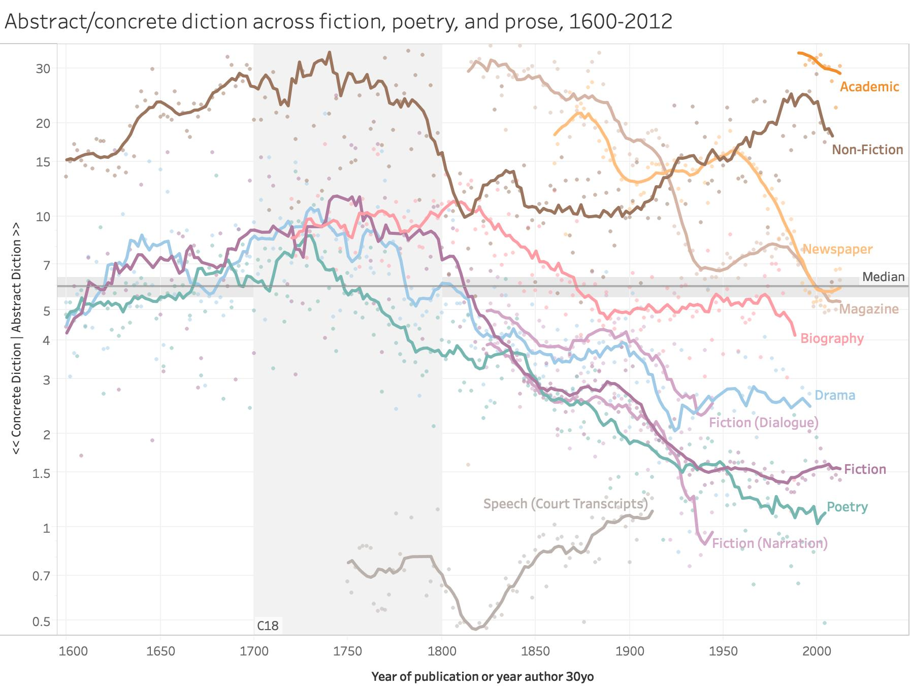

    
# Introduction to Computational Literary Analysis

## Info 

 - Digital Humanities Program, UC-Berkeley
 - Summers since 2018, also at Columbia U
 - Online only (this summer)

# General Information

## Instructor: Jonathan Reeve

 - PhD student, researcher, instructor
 - Department of English and Comparative Literature, Columbia University
 - <http://jonreeve.com>

## Course

- Course website: http://icla2021.jonreeve.com
- Text-based course communication (!)
- Zoom-free zone

# Computational Literary Analysis

## An Exciting New Field {data-background-video="https://thumbs.gfycat.com/GloriousCautiousGar-mobile.mp4"}

Also known as, or similar to: text analysis, cultural analytics, digital humanities, "distant reading"

## Reading Books with Computers

# Famous Examples

## Game of Thrones

## Loudness

## Rap Lyrics

## Abstract/Concrete

 
# But why? 

## Why computers? 

 - Procedures help us to learn.
 - New way of reading

## Why literature? 

 - Text analysis is general-purpose
 - Literature is complex language 
 - Also, literature is awesome. 

## The Great Unread

# Prerequisites

## No prerequisites

- Programming is like explaining how to make a peanut butter and jelly sandwich to a four-year-old.

## Like Making a Sandwich

<video data-autoplay loop src="https://media2.giphy.com/media/ToMjGpvCVgzcuhibKla/giphy.mp4"/>

## A sandwich? 

- Describe a process procedurally
- Break a procedure into steps

## Programming language

<video data-autoplay loop src="https://i.giphy.com/media/35aVstfJYNlEA/giphy.mp4">

## Pep talk

- It's not true that some people are better suited to coding. 
- You can do it! 

# Links

## Syllabus 

https://icla2020b.jonreeve.com

